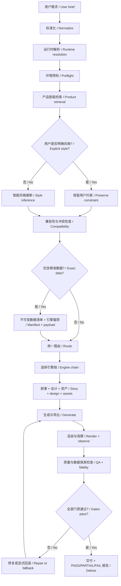

# Presentation Studio

> A catalog-driven Codex Skill that turns presentation and visual-content requests into an explainable product choice, a style decision, an engine route, an exact-data contract, and a validated deliverable.
>
> 一个由产品目录驱动的 Codex Skill：把 PPT / HTML 演示 / PDF / 封面 / 信息图 / 技术图等需求，转化为可解释的产品选择、风格决策、引擎路由、精准数据契约和经过验证的交付物。

[](https://github.com/kwhi6693-web/presentation-studio/actions/workflows/validate.yml)
[](LICENSE)
[](presentation-studio/catalog/products.json)
[](presentation-studio/catalog/styles.json)

[中文说明](#中文说明) · [English Guide](#english-guide) · [安装 / Installation](#安装) · [上游作者 / Credits](#上游作者与许可证)

## 中文说明

### 1. 它是什么

Presentation Studio 不是把四个项目简单放进同一个目录，也不是单一的 PPT 生成器。它是一个完整的“需求理解 → 智能检索 → 风格推断 → 兼容性检查 → 精准数据绑定 → 引擎编排 → 生成 → 渲染质检 → 修复回路 → 交付”工作系统。

它整合并保留了四个上游项目的专长：

- [PPT Master](https://github.com/hugohe3/ppt-master)：原生、可编辑 PPTX；图表、表格、文本与形状优先保持结构化。
- [Guizang PPT Skill](https://github.com/op7418/guizang-ppt-skill)：Swiss / editorial 视觉体系、演示者模式与强排版设计能力。
- [Frontend Slides](https://github.com/zarazhangrui/frontend-slides)：单文件 HTML 演示、浏览器交互、HTML/PDF 路径和视觉发现。
- [Baoyu Skills](https://github.com/JimLiu/baoyu-skills)：封面、文章插图、信息图、技术图、数据图像和图像型幻灯片。

在这些能力之上，本 Skill 新增了统一输入契约、13 套产品配方、8 套风格配置、可解释检索、冲突检测、精确数据清单、数据保真比较、运行环境预检、统一路由、状态语义和质量门禁。

### 2. 设计目标

1. **用户先描述目标，不必先选择工具。** 系统根据用途、受众、输出、可编辑性、数据形式和环境就绪度选择产品与引擎。
2. **明确要求永远优先。** 用户指定 PPTX、HTML、某种风格或可编辑性时，检索器不会擅自覆盖，只会报告兼容或冲突。
3. **未指定风格时才智能推断。** 风格选择会给出来源、置信度和得分证据；它是可解释决策，不是随机审美。
4. **精准数据不是“设计参考”。** 值、类型、顺序、单位、周期、标签、来源和变换都进入不可变清单，并在渲染后比较。
5. **没有执行就不能报 PASS。** 外部图片提供商、浏览器、Office/LibreOffice、字体、动画或渲染器未实际运行时，状态必须是 `PARTIAL / NOT EXECUTED`。
6. **保留来源与许可证。** 四个上游仓库、锁定提交、许可证和内置文件路径均可追踪。

### 3. 所有功能层

| 层 | 功能 | 关键输出或门禁 |
|---:|---|---|
| L0 | Skill 调用与意图识别 | 判断是创建、转换、改版、编辑、演示、导出还是验证 |
| L1 | 输入接收 | 文本、图片、表格、CSV、XLSX、JSON、Markdown 表格、现有 PPTX/HTML/PDF |
| L2 | 请求标准化 | 输出格式、可编辑性、受众、目的、主题、语气、密度、渠道、比例、资产需求 |
| L3 | 运行时解析 | 解析并验证 Python、Node、Git 的绝对路径，拒绝 WindowsApps 假别名 |
| L4 | 环境预检 | 明确返回 Python、Node、Office 渲染器、Chromium、图片提供商的就绪布尔值 |
| L5 | 产品智能检索 | 硬约束过滤 + 多维评分 + 就绪度检查，从 13 套产品中选最匹配者 |
| L6 | 风格推断 | 在用户未指定时，从 8 套风格中按主题、受众、目的、语气、密度、渠道推断 |
| L7 | 约束与冲突检测 | 检查输出、可编辑性、数据形式、比例、产品、风格、能力与先决条件是否兼容 |
| L8 | 精准数据契约 | 建立来源、溯源、字段、具体类型、缺失位置、记录 ID、重复项和允许变换清单 |
| L9 | 路由编排 | 把所选产品映射为引擎链、能力、参考规范、质量门禁和回退产品 |
| L10 | 引擎适配 | PPT Master / Guizang / Frontend Slides / Baoyu 的职责隔离与按需组合 |
| L11 | 叙事结构 | 目标、受众、主张、证据、章节节奏、每页信息职责和演讲者备注 |
| L12 | 视觉与版式 | 设计系统、字体层级、网格、留白、颜色、图表语法、插图策略和版式多样性 |
| L13 | 资产生成与发现 | 封面、插图、信息图、图表、技术图、图标与可授权外部素材 |
| L14 | 产品生成与导出 | 原生 PPTX、HTML、PDF、PNG、SVG；临时文件与正式交付边界分离 |
| L15 | 演示者运行时 | 键盘导航、焦点、减弱动效、首尾边界、打印 CSS、单文件/离线行为 |
| L16 | 渲染后数据观察 | 从实际生成物提取观察契约，与精准数据清单逐字段、逐值、逐标签比较 |
| L17 | 质量保证 | 溢出、碰撞、裁切、边距、对比度、字号、图表、可编辑性、页数、来源和输出一致性 |
| L18 | 修复与回退 | 失败分级、显式回退、重新渲染、重新检查；禁止把未通过的中间产物伪装为成品 |
| L19 | 安全、溯源与状态 | 不执行不可信嵌入代码、不泄露凭据、不越界写入；只使用 PASS / PARTIAL / FAIL |

### 4. 工作流程



执行顺序是强制的：预检必须早于推荐，推荐必须早于路由；如果有精准数据，数据清单必须早于任何渲染。用户显式约束不会被推荐器静默改写。

### 5. 智能检索到底做什么

这里的“检索”首先是**本地产品配方检索**，不依赖互联网。它不会搜索成品模板并盲目套用，而是把用户需求映射到一套可执行产品：

1. 标准化同义词和请求字段；
2. 用输出格式、产品类型、可编辑性、精准数据、数据形式、比例等硬条件排除不可能产品；
3. 按用途、受众、目的、主题、语气、信息密度、发布渠道、风格标签和资产需求进行分维评分；
4. 使用预检产生的真实环境就绪度检查必需与可选依赖；
5. 给出产品、得分证据、缺失条件、回退路径和状态；
6. 只有演示内容本身需要最新事实或外部素材时，才另行进行联网研究或资产搜索。

因此，“请帮我做一份给董事会看的可编辑融资汇报”“把这些精确营收数据做成一套 PPT”“做一个文章封面但我不知道用什么风格”，会得到不同的产品配方、风格和引擎链。

### 6. 13 套产品配方

| 产品 ID | 用途 | 输出 | 可编辑性 | 默认引擎链 |
|---|---|---|---|---|
| `native-editable-deck` | 通用商务汇报、更新、报告 | PPTX | 完全原生可编辑 | PPT Master |
| `native-data-deck` | 财务报告、数据复盘、投资者更新 | PPTX | 原生图表/表格/文本可编辑 | PPT Master |
| `swiss-editorial-deck` | 编辑型报告、战略故事、年报 | PPTX + HTML | PPTX 可编辑 | Guizang → PPT Master → Frontend Slides |
| `executive-deck` | 融资、董事会更新、决策简报 | PPTX | 完全原生可编辑 | PPT Master |
| `technical-deck` | 技术架构、工程评审、系统讲解 | PPTX | 完全原生可编辑 | PPT Master |
| `html-presenter` | 网页演示、远程演示、单文件演示 | HTML + PDF | 非 PPTX 编辑模型 | Guizang → Frontend Slides |
| `dual-format-deck` | 同一内容同时用于会议与网页 | PPTX + HTML + PDF | PPTX 可编辑 | PPT Master → Frontend Slides |
| `cover-image` | 文章、演示、社媒封面 | PNG | 栅格成品 | Baoyu |
| `article-illustration` | 文章插图、概念视觉 | PNG | 栅格成品 | Baoyu |
| `infographic-image` | 数据摘要、比较、信息图 | PNG | 栅格成品；支持精准数据契约 | Baoyu |
| `technical-diagram` | 架构图、流程图、系统图 | SVG | 矢量可编辑 | Baoyu |
| `data-image` | 图表图像、指标视觉 | PNG | 栅格成品；支持精准数据契约 | Baoyu |
| `image-slide-deck` | 视觉叙事、活动、展示型幻灯片 | PPTX | 页面为图像型，不等于原生可编辑 | Baoyu → PPT Master |

完整机器可读定义见 [`catalog/products.json`](presentation-studio/catalog/products.json)。

### 7. 8 套智能风格

| 风格 ID | 最适合 | 主要设计权威 |
|---|---|---|
| `swiss-editorial` | 战略、编辑型报告、专业叙事 | Guizang |
| `executive-minimal` | 董事会、融资、决策简报 | PPT Master |
| `data-analytical` | 财务、指标、分析、对比 | PPT Master |
| `technical-systems` | 技术架构、工程系统 | PPT Master |
| `narrative-cinematic` | 愿景、文化、沉浸式故事 | Guizang |
| `warm-educational` | 教学、培训、科普解释 | PPT Master |
| `bold-promotional` | 产品发布、营销、活动 | Guizang |
| `visual-infographic` | 数据摘要、流程、信息可视化 | Baoyu |

用户明确风格时，系统尊重该约束；用户未明确时，才根据主题、受众、目的、语气、密度和渠道进行推断。完整定义见 [`catalog/styles.json`](presentation-studio/catalog/styles.json)。

### 8. 精准数据如何进入 PPT 或图片

当 `has_exact_data=true` 时，系统使用独立的数据绑定层，而不是把数值塞进自然语言提示后祈祷模型抄对：

1. 记录 `source`、`source_form` 和 `provenance`；
2. 固化字段顺序、字段名、声明类型与每个值的具体类型；
3. 保留单位、周期、标签、缺失位置、记录 ID 和重复项；
4. 只允许已声明、已记录的变换；
5. 为 `native-data-deck`、`infographic-image` 或 `data-image` 生成产品专用载荷和绑定目标；
6. 生成后从实际结构化对象建立观察契约；
7. 比较所有请求维度，只有真实一致才可通过数据保真门禁。

对于 PPTX，优先使用原生图表、原生表格和结构化文本，不允许用截图或人工重画冒充可编辑精准数据。对于 PNG 信息图/数据图，数据契约仍会保留并参与比较，但最终像素本身不是可编辑结构。

### 9. 质量保证与诚实状态

质量循环覆盖：叙事完整性、文字溢出、对象碰撞、页面边距、字号、对比度、图片裁切、槽位比例、图表完整性、原生可编辑性、演讲者备注、键盘行为、减弱动效、离线/单文件行为、输出页数、格式间一致性和来源追踪。

- `PASS`：所需命令和门禁已经在当前环境真实运行并通过。
- `PARTIAL`：核心结果可用，但有明确的未执行依赖、降级或未关闭门禁。
- `FAIL`：必需输入、包完整性、硬约束或交付门禁失败。

如果没有 PowerPoint/LibreOffice、Chromium、图片提供商凭据或实际渲染器，系统不会把对应检查写成 PASS。

### 10. 支持的输入与输出

**输入**：自然语言需求、文本大纲、图片、CSV、XLSX、JSON、Markdown 表格、结构化数据、现有 PPTX、HTML/PDF 演示资料，以及用户给出的品牌或风格约束。

**输出**：原生可编辑 PPTX、图像型 PPTX、单文件 HTML、PDF、PNG 封面/插图/信息图/数据图、SVG 技术图，以及验证/路由/数据保真报告。

## 安装

### 前置条件

- Codex 或支持本地 Skills 的兼容 Agent 环境。
- Python 3：统一检索、路由、数据绑定和 PPT Master 路径需要。
- Node.js：Guizang、Frontend Slides、Baoyu 路径需要。
- 可选：PowerPoint 或 LibreOffice（PPTX 渲染检查）、Chromium/Playwright（HTML/PDF 渲染检查）、图片提供商凭据（AI 图片能力）。

缺少可选依赖不会使整个 Skill 无法安装，但受影响的产品会显示 `PARTIAL`、禁用能力或选择回退产品。

### 方法 A：Git 克隆 + 安装脚本（推荐）

Windows PowerShell：

```powershell
git clone https://github.com/kwhi6693-web/presentation-studio.git
cd presentation-studio
Set-ExecutionPolicy -Scope Process Bypass
.\scripts\install.ps1
```

默认安装到 `%USERPROFILE%\.agents\skills\presentation-studio`。如果目标已存在，安装器会停止；需要更新时使用可恢复备份模式：

```powershell
.\scripts\install.ps1 -Force
```

安装到 Codex 专用目录：

```powershell
.\scripts\install.ps1 -Destination "$env:USERPROFILE\.codex\skills\presentation-studio"
```

macOS / Linux：

```bash
git clone https://github.com/kwhi6693-web/presentation-studio.git
cd presentation-studio
chmod +x scripts/install.sh
./scripts/install.sh
```

更新现有安装时：

```bash
FORCE=1 ./scripts/install.sh
```

两个安装器都不会直接删除旧版本；强制更新时会把旧目录移动到带时间戳的同级备份，再复制新版本。

### 方法 B：下载 ZIP

下载 [`dist/presentation-studio.zip`](dist/presentation-studio.zip)，解压到 `~/.agents/skills/`。最终结构必须是：

```text
~/.agents/skills/presentation-studio/SKILL.md
```

不要多套一层目录。安装后重启 Codex，让技能目录重新发现。

### 方法 C：手动复制

只复制仓库中的 `presentation-studio/` 目录到：

- Windows：`%USERPROFILE%\.agents\skills\presentation-studio`
- macOS/Linux：`~/.agents/skills/presentation-studio`

### 安装后验证

在仓库根目录运行无第三方依赖的完整包校验：

```powershell
python scripts/verify_package.py
```

它会检查必需文件、Skill 元数据、13 个产品、8 个风格、4 个引擎、四个来源锁、缓存污染、ZIP 路径安全、中文路径 UTF-8 标志，以及目录与 ZIP 的逐文件 SHA-256 一致性。

### 11. 怎么调用

直接写自然语言即可；也可以显式引用 Skill：

```text
$presentation-studio 请为投资委员会制作一套 12 页、可编辑 PPTX，
主题是新能源项目融资；我没有指定风格，请自动选择最合适的风格并解释理由。
```

精准数据示例：

```text
$presentation-studio 使用我提供的季度营收、毛利率和同比数据制作原生可编辑 PPTX。
必须保留字段顺序、单位、季度标签和所有小数位；生成后逐值核对。
```

图片产品示例：

```text
$presentation-studio 为这篇 AI 治理文章生成 3:4 封面；我没有指定风格，
请从产品与风格目录中检索最匹配的一套，并在生成前说明选择。
```

系统应先说明选择的产品、风格、引擎、理由、缺失先决条件和状态，再进入生成。

### 12. 仓库结构

```text
presentation-studio/
├─ README.md                    # 中英双语完整说明
├─ CONTRIBUTORS.md              # 上游作者与整合维护者
├─ THIRD_PARTY_NOTICES.md        # 来源、锁定提交与许可证
├─ LICENSE                      # 仓库层 AGPL-3.0
├─ dist/presentation-studio.zip # 可直接安装的完整包
├─ scripts/
│  ├─ install.ps1               # Windows 可恢复安装器
│  ├─ install.sh                # macOS/Linux 可恢复安装器
│  └─ verify_package.py         # 目录/目录表/ZIP/哈希验证器
└─ presentation-studio/         # 实际 Skill 根目录
   ├─ SKILL.md                  # 入口与强制工作顺序
   ├─ agents/                   # Agent 配置
   ├─ catalog/                  # 产品与风格目录
   ├─ core/                     # 请求、检索、数据绑定、路由核心
   ├─ engines/                  # 四个锁定上游引擎
   ├─ references/               # 工作规范与质量权威
   ├─ scripts/                  # 预检、推荐、路由、验证入口
   └─ source-lock.json          # 来源、版本、许可证与依赖真值
```

### 13. 能力边界

- 产品检索与风格推断是本地、确定性流程；它不是通用互联网搜索引擎。
- 需要“最新数据/事实”的演示，仍应先从可靠来源研究并保留引用。
- AI 图片生成依赖可用提供商及其凭据；没有提供商时必须明确降级。
- 完整视觉验收依赖实际渲染环境。只有结构校验并不等于像素级验收。
- `image-slide-deck` 的 PPTX 是图像型页面，不等于原生元素可编辑；需要可编辑时应改用原生产品。
- 本仓库提供工作流、代码、模板与已锁定引擎；输出质量仍取决于输入内容、字体、渲染器与所选外部服务。

### 上游作者与许可证

本项目尊重并保留四个上游项目的成果和署名：

- Hugo He / [`@hugohe3`](https://github.com/hugohe3) — [PPT Master](https://github.com/hugohe3/ppt-master), MIT。
- [`@op7418`](https://github.com/op7418) — [Guizang PPT Skill](https://github.com/op7418/guizang-ppt-skill), AGPL-3.0。
- [`@zarazhangrui`](https://github.com/zarazhangrui) — [Frontend Slides](https://github.com/zarazhangrui/frontend-slides), MIT。
- Jim Liu / [`@JimLiu`](https://github.com/JimLiu) — [Baoyu Skills](https://github.com/JimLiu/baoyu-skills), MIT。

精确提交和内置许可证路径见 [THIRD_PARTY_NOTICES.md](THIRD_PARTY_NOTICES.md) 与 [`source-lock.json`](presentation-studio/source-lock.json)。完整贡献者说明见 [CONTRIBUTORS.md](CONTRIBUTORS.md)。

---

## English Guide

### 1. What it is

Presentation Studio is not a folder that merely concatenates four projects, and it is not a single PPT generator. It is an end-to-end operating system for **brief understanding → intelligent retrieval → style inference → compatibility checks → exact-data binding → engine orchestration → generation → rendered QA → repair loops → delivery**.

It preserves and coordinates four upstream strengths:

- [PPT Master](https://github.com/hugohe3/ppt-master): native editable PPTX with structured charts, tables, text, and shapes.
- [Guizang PPT Skill](https://github.com/op7418/guizang-ppt-skill): Swiss/editorial design systems, typography, and presenter behavior.
- [Frontend Slides](https://github.com/zarazhangrui/frontend-slides): single-file HTML decks, browser interaction, HTML/PDF routes, and visual discovery.
- [Baoyu Skills](https://github.com/JimLiu/baoyu-skills): covers, article illustrations, infographics, diagrams, data images, and image-led slide decks.

The integration adds a shared request contract, 13 product recipes, 8 style profiles, explainable retrieval, conflict reporting, immutable exact-data manifests, fidelity comparison, runtime preflight, unified routing, status semantics, and quality gates.

### 2. Design principles

1. **Describe the outcome before choosing a tool.** The system selects a product and engine from purpose, audience, output, editability, data form, and runtime readiness.
2. **Explicit constraints always win.** A named output, product, style, or editability requirement is preserved; the system reports conflicts instead of silently rewriting it.
3. **Styles are inferred only when omitted.** An inferred style includes its evidence, score, and confidence.
4. **Exact data is not a visual suggestion.** Values, concrete types, order, units, periods, labels, source, provenance, and approved transformations are contract data.
5. **No execution means no PASS.** Unexecuted provider, browser, Office/LibreOffice, font, animation, or render checks remain `PARTIAL / NOT EXECUTED`.
6. **Provenance stays visible.** Upstream repositories, pinned commits, licenses, and vendored license files remain traceable.

### 3. Functional layers

| Layer | Responsibility | Main output or gate |
|---:|---|---|
| L0 | Invocation and intent | Create, convert, redesign, edit, present, export, or validate |
| L1 | Input intake | Text, images, tables, CSV, XLSX, JSON, Markdown tables, existing decks |
| L2 | Normalization | Outputs, editability, audience, purpose, topic, tone, density, channel, aspect ratio |
| L3 | Runtime resolution | Absolute validated Python, Node, and Git paths; fake WindowsApps aliases rejected |
| L4 | Preflight | Explicit readiness booleans for Python, Node, Office renderer, Chromium, image provider |
| L5 | Intelligent product retrieval | Hard filters, multidimensional scoring, readiness checks, product recommendation |
| L6 | Style inference | Topic-, audience-, purpose-, tone-, density-, and channel-aware style selection |
| L7 | Compatibility and conflicts | Output, editability, data form, aspect ratio, product, style, capability, prerequisite checks |
| L8 | Exact-data contract | Source, provenance, ordered fields, concrete types, missing positions, IDs, duplicates, transformations |
| L9 | Routing | Product to engine chain, capabilities, references, quality gates, and fallback |
| L10 | Engine adaptation | Isolated responsibilities across PPT Master, Guizang, Frontend Slides, and Baoyu |
| L11 | Narrative architecture | Audience, objective, claim, evidence, sections, slide responsibilities, speaker notes |
| L12 | Visual system and layout | Typography, grid, spacing, color, chart grammar, imagery, layout variety |
| L13 | Asset generation and discovery | Covers, illustrations, infographics, charts, diagrams, icons, approved external assets |
| L14 | Generation and export | Native PPTX, HTML, PDF, PNG, SVG; temporary and final-output boundaries |
| L15 | Presenter runtime | Keyboard navigation, focus, reduced motion, boundaries, print CSS, offline behavior |
| L16 | Post-render observation | Extract an observed contract and compare it to the exact-data manifest |
| L17 | Quality assurance | Overflow, collision, crop, margin, contrast, font size, charts, editability, pages, provenance |
| L18 | Repair and fallback | Classified failures, explicit fallback, rerendering, reinspection, no false deliverables |
| L19 | Security, provenance, status | Untrusted-content controls, credential redaction, output boundaries, PASS/PARTIAL/FAIL |

The bilingual diagram in [the workflow section](#4-工作流程) is the canonical end-to-end sequence. Preflight precedes recommendation; recommendation precedes routing; exact-data manifests precede rendering.

### 4. Intelligent retrieval

“Retrieval” first means **local product-recipe retrieval**, not a web search. The pipeline:

1. normalizes request fields and supported synonyms;
2. eliminates impossible recipes using output, kind, editability, exact-data, data-form, and aspect-ratio constraints;
3. scores intended use, audience, purpose, topic, tone, density, channel, style tags, and asset needs by dimension;
4. incorporates preflight-derived required and optional prerequisite readiness;
5. returns the selected product, evidence, missing prerequisites, fallback, and status;
6. browses externally only when the content itself requires current evidence or approved assets.

This is why an editable board fundraising deck, a deck driven by exact revenue data, and an article cover with no stated style resolve to different product/style/engine combinations.

### 5. Product recipes

| Product ID | Primary use | Outputs | Editability | Engine chain |
|---|---|---|---|---|
| `native-editable-deck` | General business decks and reports | PPTX | Fully native editable | PPT Master |
| `native-data-deck` | Financial reports and metric reviews | PPTX | Native charts/tables/text | PPT Master |
| `swiss-editorial-deck` | Editorial reports and strategy stories | PPTX + HTML | Editable PPTX | Guizang → PPT Master → Frontend Slides |
| `executive-deck` | Fundraising, board, and decision briefs | PPTX | Fully native editable | PPT Master |
| `technical-deck` | Architecture and engineering reviews | PPTX | Fully native editable | PPT Master |
| `html-presenter` | Web, remote, single-file presenting | HTML + PDF | HTML model | Guizang → Frontend Slides |
| `dual-format-deck` | Shared meeting and web content | PPTX + HTML + PDF | Editable PPTX | PPT Master → Frontend Slides |
| `cover-image` | Article, deck, and social covers | PNG | Raster | Baoyu |
| `article-illustration` | Editorial and concept illustrations | PNG | Raster | Baoyu |
| `infographic-image` | Data summaries and comparisons | PNG | Raster; exact-data contract supported | Baoyu |
| `technical-diagram` | Architecture, process, and system diagrams | SVG | Editable vector | Baoyu |
| `data-image` | Chart images and metric visuals | PNG | Raster; exact-data contract supported | Baoyu |
| `image-slide-deck` | Visual storytelling and showcases | PPTX | Image-led, not native-element editable | Baoyu → PPT Master |

The machine-readable source of truth is [`catalog/products.json`](presentation-studio/catalog/products.json).

### 6. Style profiles

| Style ID | Best fit | Design authority |
|---|---|---|
| `swiss-editorial` | Strategy, editorial reports, professional narratives | Guizang |
| `executive-minimal` | Board, fundraising, decision briefs | PPT Master |
| `data-analytical` | Finance, metrics, analysis, comparison | PPT Master |
| `technical-systems` | Architecture and engineering systems | PPT Master |
| `narrative-cinematic` | Vision, culture, immersive stories | Guizang |
| `warm-educational` | Teaching, training, approachable explainers | PPT Master |
| `bold-promotional` | Launches, campaigns, events | Guizang |
| `visual-infographic` | Data summaries, processes, visual explanation | Baoyu |

An explicit user style is preserved. Otherwise, the system infers one from topic, audience, purpose, tone, density, and channel. See [`catalog/styles.json`](presentation-studio/catalog/styles.json).

### 7. Exact-data lifecycle

When `has_exact_data=true`, the dedicated data-binding layer:

1. records `source`, `source_form`, and `provenance`;
2. freezes ordered field names, declared types, and every value's concrete type;
3. preserves units, periods, labels, missing positions, record IDs, and duplicates;
4. allows only documented transformations;
5. builds product-specific payloads and binding targets for `native-data-deck`, `infographic-image`, or `data-image`;
6. extracts a post-generation observed contract from the structured artifact;
7. compares every requested dimension before the data-fidelity gate can pass.

PPTX routes prefer native charts, native tables, and structured text—screenshots or manual redraws cannot masquerade as editable exact data. PNG data products preserve and validate the contract, but the final pixels are not editable objects.

### 8. QA and honest status

The quality loop covers narrative integrity, overflow, collision, margins, hierarchy, font size, contrast, crop, slot ratios, chart integrity, native editability, notes, keyboard behavior, reduced motion, offline/single-file behavior, page count, cross-format parity, and source traceability.

- `PASS`: required commands and gates actually ran successfully in the current environment.
- `PARTIAL`: the core result is usable, with an explicit unexecuted prerequisite, degradation, or open gate.
- `FAIL`: a required input, package integrity check, hard constraint, or delivery gate failed.

Missing PowerPoint/LibreOffice, Chromium, provider credentials, or an actual renderer is never reported as a completed visual check.

### Installation

#### Prerequisites

- Codex or a compatible local-Skill agent environment.
- Python 3 for retrieval, routing, data binding, and PPT Master paths.
- Node.js for Guizang, Frontend Slides, and Baoyu paths.
- Optional: PowerPoint or LibreOffice for PPTX rendering, Chromium/Playwright for HTML/PDF rendering, and image-provider credentials for AI imagery.

Missing optional dependencies do not prevent installation; affected products become partial, disable that capability, or use an explicit fallback.

#### Method A: Git clone plus safe installer (recommended)

Windows PowerShell:

```powershell
git clone https://github.com/kwhi6693-web/presentation-studio.git
cd presentation-studio
Set-ExecutionPolicy -Scope Process Bypass
.\scripts\install.ps1
```

The default destination is `%USERPROFILE%\.agents\skills\presentation-studio`. To update an existing installation with a recoverable timestamped backup:

```powershell
.\scripts\install.ps1 -Force
```

To target Codex's dedicated Skill directory:

```powershell
.\scripts\install.ps1 -Destination "$env:USERPROFILE\.codex\skills\presentation-studio"
```

macOS/Linux:

```bash
git clone https://github.com/kwhi6693-web/presentation-studio.git
cd presentation-studio
chmod +x scripts/install.sh
./scripts/install.sh
```

For a recoverable update:

```bash
FORCE=1 ./scripts/install.sh
```

Neither installer deletes the previous Skill in place. Force mode first moves it to a timestamped sibling backup.

#### Method B: ZIP

Download [`dist/presentation-studio.zip`](dist/presentation-studio.zip) and extract it under `~/.agents/skills/`. The final path must be:

```text
~/.agents/skills/presentation-studio/SKILL.md
```

Restart Codex after installation so Skill discovery runs again.

#### Method C: manual copy

Copy only the repository's `presentation-studio/` directory to:

- Windows: `%USERPROFILE%\.agents\skills\presentation-studio`
- macOS/Linux: `~/.agents/skills/presentation-studio`

#### Verify the package

From the repository root:

```bash
python scripts/verify_package.py
```

The dependency-free verifier checks required files, Skill metadata, 13 products, 8 styles, 4 engines, four provenance locks, cache pollution, ZIP path safety, UTF-8 flags for non-ASCII names, and per-file SHA-256 parity between the folder and ZIP.

### 9. Usage examples

Natural language is sufficient, or invoke the Skill explicitly:

```text
$presentation-studio Create a 12-slide editable PPTX for an investment committee
about renewable-energy project financing. I did not specify a style; choose the
best fit and explain the recommendation before generating.
```

Exact-data example:

```text
$presentation-studio Build a native editable PPTX from the supplied quarterly
revenue, gross-margin, and YoY data. Preserve field order, units, quarter labels,
and every decimal place, then compare the generated values field by field.
```

Image-product example:

```text
$presentation-studio Create a 3:4 cover for this AI-governance article. I did not
specify a style; retrieve the best product and style, then explain the choice.
```

Before generation, the system should report the selected product, style, engine chain, evidence, missing prerequisites, and status.

### 10. Repository layout

```text
presentation-studio/
├─ README.md
├─ CONTRIBUTORS.md
├─ THIRD_PARTY_NOTICES.md
├─ LICENSE
├─ dist/presentation-studio.zip
├─ scripts/
│  ├─ install.ps1
│  ├─ install.sh
│  └─ verify_package.py
└─ presentation-studio/
   ├─ SKILL.md
   ├─ agents/
   ├─ catalog/
   ├─ core/
   ├─ engines/
   ├─ references/
   ├─ scripts/
   └─ source-lock.json
```

### 11. Boundaries

- Product retrieval and style inference are local deterministic processes, not a general web search engine.
- A deck requiring current facts still needs source-backed research and citations.
- AI imagery requires an available provider and credentials; no-provider cases must degrade explicitly.
- Full visual approval requires a real renderer. Structural validation alone is not pixel-level approval.
- `image-slide-deck` produces image-led PPTX pages, not native editable slide elements; choose a native product when editability is mandatory.
- Final quality also depends on the supplied content, fonts, renderer, and selected external services.

### Credits and licensing

Presentation Studio preserves and credits the four upstream works:

- Hugo He / [`@hugohe3`](https://github.com/hugohe3) — [PPT Master](https://github.com/hugohe3/ppt-master), MIT.
- [`@op7418`](https://github.com/op7418) — [Guizang PPT Skill](https://github.com/op7418/guizang-ppt-skill), AGPL-3.0.
- [`@zarazhangrui`](https://github.com/zarazhangrui) — [Frontend Slides](https://github.com/zarazhangrui/frontend-slides), MIT.
- Jim Liu / [`@JimLiu`](https://github.com/JimLiu) — [Baoyu Skills](https://github.com/JimLiu/baoyu-skills), MIT.

Exact commits and vendored license paths are documented in [THIRD_PARTY_NOTICES.md](THIRD_PARTY_NOTICES.md) and [`source-lock.json`](presentation-studio/source-lock.json). See [CONTRIBUTORS.md](CONTRIBUTORS.md) for the complete attribution policy.

