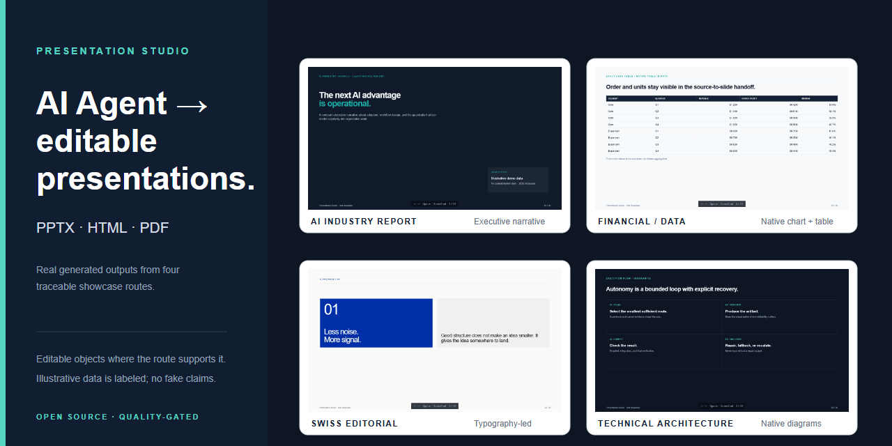
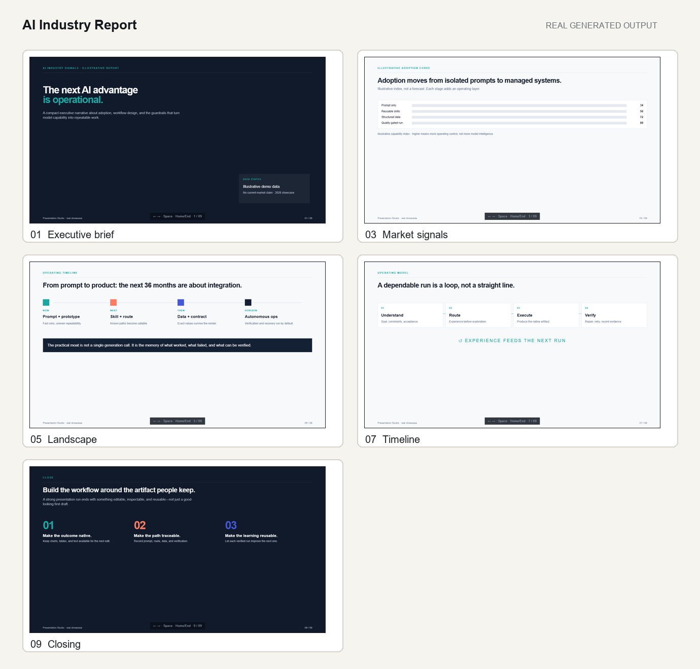
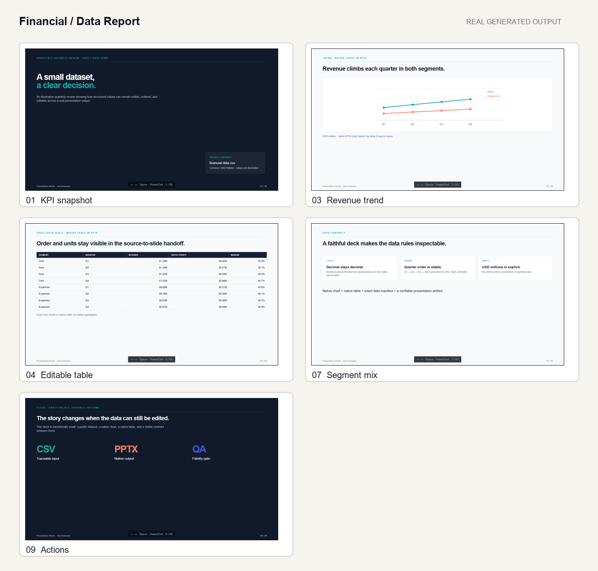
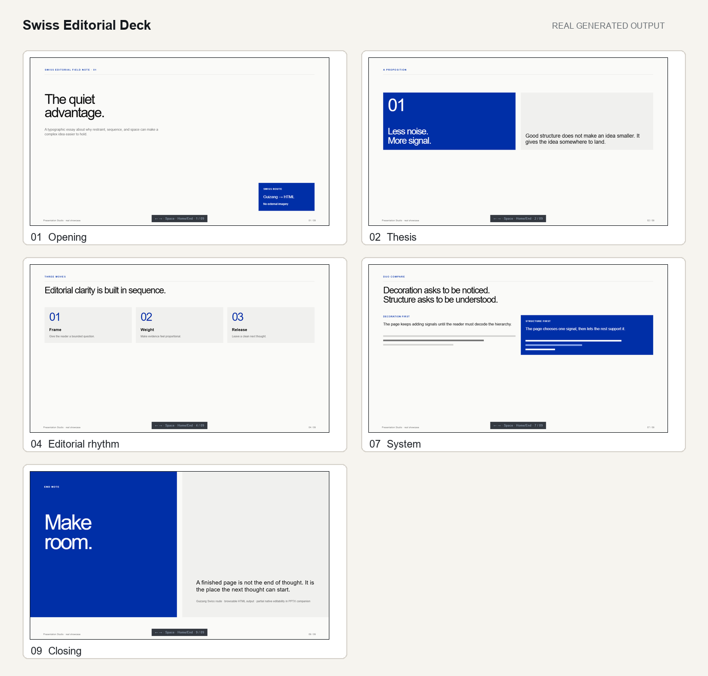
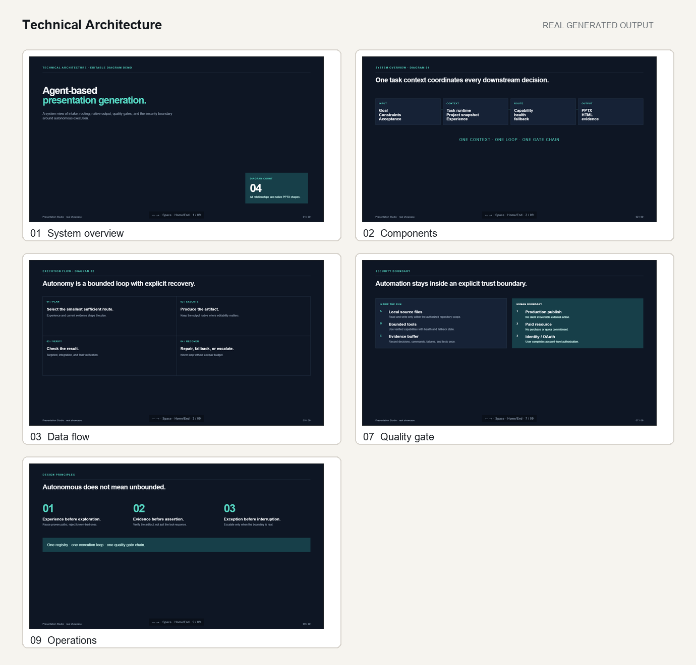

# Presentation Studio

> 让 AI Agent 把提示词和结构化数据转成高质量、可编辑的 PPTX、HTML 演示和视觉内容。

[English](README.md) · [简体中文](README.zh-CN.md) · [繁體中文](README.zh-TW.md)

[](https://github.com/kwhi6693-web/presentation-studio/releases/latest)
[](#兼容性模型)
[](https://github.com/kwhi6693-web/presentation-studio/actions/workflows/validate.yml)
[](https://github.com/kwhi6693-web/presentation-studio/actions/workflows/sync-upstreams.yml)
[](presentation-studio/catalog/products.json)
[](presentation-studio/catalog/styles.json)
[](LICENSE)



## 为什么选择 Presentation Studio

从提示词或结构化数据开始，得到可以打开、编辑、检查并复用的演示成果。

| 可编辑 PPTX | 多格式输出 | Agent 适配 | 质量门禁 |
|---|---|---|---|
| 在支持的 route 上保留原生文本、图表、表格、形状与连接线 | PPTX、HTML、PDF、PNG 与 SVG | 基于 Catalog 的 route 会适配运行时实际可用的宿主能力 | 验证、渲染、检查、修复，再次验证 |

## 展示案例

下面四套案例是本仓库本轮根据可追溯 prompt 与示例数据真实生成的成果，不是验收 fixture、旧参考截图或概念占位图。

### AI 行业报告



- **Prompt：** [prompt.md](docs/showcase/ai-industry-report/prompt.md)
- **输出：** [PPTX](docs/showcase/ai-industry-report/ai-industry-report.pptx) · [HTML](docs/showcase/ai-industry-report/ai-industry-report.html) · [PDF](docs/showcase/ai-industry-report/ai-industry-report.pdf)
- **Route：** `ppt-master → native-editable-deck`；PPTX 中的文字、形状和图表为原生对象，图表数字明确标注为 illustrative demo data。
- **目录：** [docs/showcase/ai-industry-report](docs/showcase/ai-industry-report/)

### 财务 / 数据报告



- **Prompt：** [prompt.md](docs/showcase/financial-data-report/prompt.md)
- **输出：** [PPTX](docs/showcase/financial-data-report/financial-data-report.pptx) · [HTML](docs/showcase/financial-data-report/financial-data-report.html) · [PDF](docs/showcase/financial-data-report/financial-data-report.pdf)
- **Route：** `ppt-master → native-data-deck`；PPTX 包含原生图表与原生表格，数值和顺序与 [financial-data.csv](docs/showcase/financial-data-report/financial-data.csv) 及 [精确数据证据](docs/showcase/financial-data-report/exact-data-manifest.json) 对照验证。
- **目录：** [docs/showcase/financial-data-report](docs/showcase/financial-data-report/)

### Swiss 编辑式演示



- **Prompt：** [prompt.md](docs/showcase/swiss-editorial-deck/prompt.md)
- **输出：** [HTML](docs/showcase/swiss-editorial-deck/swiss-editorial-deck.html) · [PPTX companion](docs/showcase/swiss-editorial-deck/swiss-editorial-deck.pptx) · [PDF](docs/showcase/swiss-editorial-deck/swiss-editorial-deck.pdf)
- **Route：** `guizang → ppt-master → frontend-slides`；HTML 是主要可浏览成果，PPTX companion 保留文字和几何图形为原生对象，但可编辑性为部分支持。
- **目录：** [docs/showcase/swiss-editorial-deck](docs/showcase/swiss-editorial-deck/)

### 技术架构



- **Prompt：** [prompt.md](docs/showcase/technical-architecture/prompt.md)
- **输出：** [PPTX](docs/showcase/technical-architecture/technical-architecture.pptx) · [HTML](docs/showcase/technical-architecture/technical-architecture.html) · [PDF](docs/showcase/technical-architecture/technical-architecture.pdf)
- **Route：** `ppt-master → technical-deck`；四页图示由原生 PPTX 形状和连接线组成，边界记录在 [architecture.json](docs/showcase/technical-architecture/architecture.json)。
- **目录：** [docs/showcase/technical-architecture](docs/showcase/technical-architecture/)

## 快速开始

1. 下载[最新 Release](https://github.com/kwhi6693-web/presentation-studio/releases/latest)，并使用对应 `.sha256` 文件校验 `presentation-studio.zip`。
2. 解压 `presentation-studio/` Skill 根目录，放入 Agent/Harness 使用的 Skill 目录。
3. 给 Agent 一段类似这样的 prompt：

```text
根据这份 CSV 制作一份 16:9 季度报告。
返回可编辑 PPTX、HTML 和 PDF，保留每个数值与单位，
并在交付前检查每一页的布局和数据保真度。
```

4. 得到带有适用验证边界记录的 PPTX、HTML 和/或 PDF 成品。

完整的[安装](#安装)、[使用](#使用)和按能力划分的验证说明见下文。

## 🧭 项目概览

Presentation Studio 将自然语言 brief、精准数据和已有素材，转化为可解释的产品选择与引擎路由。核心 Skill contract 在实现允许的范围内保持宿主无关：Agent/Harness 提供运行时能力，Presentation Studio 提供目录驱动的路由、数据契约、原生生成边界、溯源记录与渲染质量门禁。

| 快速了解 | 当前契约 |
|---|---|
| 产品目录 | 13 个产品配方与 8 个风格配置 |
| 集成引擎 | 4 个上游引擎，并通过白名单同步 |
| 输出类型 | PPTX、HTML、PDF、PNG、SVG |
| 质量模型 | 验证 → 渲染 → 检查 → 修复 → 再次验证 |
| 兼容性模型 | 基于能力；分别记录设计支持与已验证状态 |

## 💡 解决什么问题？

从 brief 到最终文件的过程中，演示项目经常丢失数据保真度、可编辑性、视觉一致性或验证证据。单个 prompt 也无法自动知道宿主是否提供 Python、Node、Chromium、Office 渲染或图像 Provider。

Presentation Studio 把这些决策明确化：

- 规范化 brief 并执行宿主 preflight；
- 从本地 Catalog 检索产品与风格；
- 路由到单一引擎或混合引擎链；
- 生成原生或可发布输出；
- 报告 route 结果、文件、证据与能力边界。

## ✨ 核心能力

| 能力层 | 实际覆盖 | 结果 |
|---|---|---|
| 意图与产品决策 | brief 规范化、preflight、13 个产品检索、风格推断、冲突识别 | 可解释的产品/风格选择 |
| 数据契约与路由 | 精准数据 manifest、类型/顺序/单位保护、单引擎与混合路由 | 可审计的引擎计划 |
| 内容与视觉生产 | 叙事、布局、图表、封面、插图、信息图、示意图 | 内容与素材计划 |
| 多格式原生生成 | 可编辑 PPTX、独立 HTML、PDF、PNG、SVG、演示者导航 | 原生或可发布文件 |
| 渲染验收与修复 | 溢出、碰撞、字体、对比度、页数、交互、打印、离线行为 | 经过质量门禁的结果 |
| 安全、溯源与状态 | 不可信内容边界、凭据保护、许可证/来源记录、route 状态 | 可复现的证据 |
| 上游持续同步 | 稳定版本发现、白名单导入、许可证检查、验证后同步 PR | 可维护的集成 |

完整的 L0-L19 职责图见[架构说明](docs/architecture.md)。

## 🧩 产品、输出与引擎

产品目录的源数据是 [products.json](presentation-studio/catalog/products.json)。公共索引包含 13 个产品配方：

| 产品 | 典型用途 | 输出 | 引擎链 |
|---|---|---|---|
| native-editable-deck | 通用汇报与业务更新 | PPTX | ppt-master |
| native-data-deck | 财务报告与指标复盘 | PPTX | ppt-master |
| swiss-editorial-deck | Swiss/editorial 策略或年度叙事 | PPTX、HTML | guizang → ppt-master → frontend-slides |
| executive-deck | 董事会、投资人与决策简报 | PPTX | ppt-master |
| technical-deck | 架构与工程评审 | PPTX | ppt-master |
| html-presenter | 单文件 Web 演示与演示者模式 | HTML、PDF | guizang → frontend-slides |
| dual-format-deck | 会议与 Web 共用内容 | PPTX、HTML、PDF | ppt-master → frontend-slides |
| cover-image | 文章、演示与社交媒体封面 | PNG | baoyu |
| article-illustration | 编辑插图与概念视觉 | PNG | baoyu |
| infographic-image | 数据摘要与对比信息图 | PNG | baoyu |
| technical-diagram | 架构、系统与流程图 | SVG | baoyu |
| data-image | 指标视觉与图表图片 | PNG | baoyu |
| image-slide-deck | 图片主导的叙事演示 | 带图片页面的 PPTX | baoyu → ppt-master |

| 引擎 | 适用范围 | 边界 |
|---|---|---|
| [PPT Master](https://github.com/hugohe3/ppt-master) | 原生 PPTX、图表、表格、备注、动画与模板 | 负责 PowerPoint 原生对象；Office 渲染另行检查 |
| [Guizang PPT Skill](https://github.com/op7418/guizang-ppt-skill) | Swiss/editorial 设计系统、叙事与版式 | 提供设计权威，最终文件由所选渲染器生成 |
| [Frontend Slides](https://github.com/zarazhangrui/frontend-slides) | 独立 HTML、键盘导航、演示者行为、HTML 转 PDF | 浏览器/PDF QA 需要已解析的 Chromium/Playwright 能力 |
| [Baoyu Skills](https://github.com/JimLiu/baoyu-skills) | 封面、插图、信息图、示意图、数据图片与图片页 | Provider 图像是可选能力；SVG 示意图不是原生 PowerPoint 对象 |

## 🔍 兼容性模型

### 设计支持与已验证

下面的**兼容性矩阵**是当前宿主证据的公开来源。

Skill contract 和核心逻辑面向能够提供所需本地能力的兼容 Agent/Harness 设计。“设计支持”描述架构和契约目标；“已验证”只用于当前验证证据实际执行过的宿主/route。

| 宿主 / Agent 能力 | Skill contract | 核心路由 | 本地脚本 | 原生生成 | 渲染 QA | 验证状态 |
|---|---|---|---|---|---|---|
| Codex | Supported | Supported | Supported | 取决于能力 | 取决于运行时 | 已验证当前主机上的核心/包契约；可选渲染器与 Provider route 另行报告 |
| 其他具备能力的 Agent / Harness | Designed | Designed | 需要本地运行时 | 取决于宿主 | 取决于运行时 | 按能力设计，本次未独立验证 |

这不是“所有 Agent 都支持”的声明。应按具体 route 与能力判断。例如宿主有 Python 和原生 PPTX 核心，但没有 Chromium 或 image provider 时：

| Route | 结果 | 含义 |
|---|---|---|
| 原生 PPTX 生成 | 所需引擎路径成功时为 PASS | 缺少浏览器不会自动否定 PPTX route |
| HTML 渲染 QA / HTML 转 PDF | PARTIAL 或 NOT EXECUTED | 受影响检查需要 Chromium/Playwright |
| Provider 图像生成 | NOT AVAILABLE | 未配置 Provider，应选择非 Provider route 或报告限制 |
| 必需运行时缺失或硬约束冲突 | FAIL | 选定 route 无法满足必需契约 |

PASS、PARTIAL、FAIL 是 route 结果；NOT AVAILABLE 和 NOT EXECUTED 用于明确能力缺口，不能被解释为整个 Skill 不兼容。

`presentation-studio/agents/openai.yaml` 是可选的 OpenAI/Codex 宿主描述文件，不是核心 Skill 必需项。上游 Baoyu 中可能存在可选的 `baoyu-codex-imagegen` 适配器；Provider 与 Codex CLI 都只属于可选的上游能力路径。

## 🎯 范围与保证

先使用满足目标输出的最小 route；当交付物或验收条件需要时，再扩展验证范围。

| Route | 提供内容 | 不代表 |
|---|---|---|
| 快速原生路径 | 产品选择、payload 准备、本地生成与可编辑 PPTX route 检查 | 不会自动证明浏览器、Office、Provider 或渲染 PDF 行为 |
| 完整路径 | 环境 preflight、精准数据校验、渲染 QA、包校验与证据报告 | 仍会报告宿主不可用或未执行的能力 |
| 图片主导产品 | 图片叙事或视觉素材，包括 PNG/SVG 输出 | 不能把图片主导的 deck 描述为对象可编辑 deck |

原生/可编辑边界如下：

| 输出类型 | 边界 |
|---|---|
| PPTX | 请求可编辑时，图表、表格、文本和形状应使用原生 PowerPoint 对象；Office 渲染单独检查 |
| HTML | 独立文件可以提供键盘导航和演示者行为；浏览器/PDF 准备度取决于 Chromium/Playwright |
| PDF | 可发布输出取决于所选渲染器及页面尺寸/渲染检查 |
| PNG / SVG | 视觉素材是原生图像/矢量输出；SVG 示意图不是原生 PowerPoint 对象 |

## 📐 精准数据与可编辑性

精准数据任务需要三份可比较的记录：

| 记录 | 契约 |
|---|---|
| 已校验 manifest | 声明源数据的数值、类型、单位、顺序、重复项与缺失值 |
| 所选引擎 payload | 将完整数据契约带入路由后的引擎 |
| 渲染后的 observed contract | 确认最终渲染交付物实际包含的内容 |

在把数据结果标为 PASS 前，必须比较这三份记录。缺失值、重复值、长度不一致或 observed contract 不完整时，结果最高只能是 PARTIAL。

需要原生可编辑时，图表、表格、文本和形状应使用原生 PowerPoint 对象。不能用整页截图替代可编辑 deck；图片主导产品仍应准确描述为图片主导，而不是对象可编辑的 deck。

## 📋 运行要求

宿主 Agent/Harness 提供能力；Skill 报告每条 route 实际能够使用什么。

| 能力 | 用于 | 不可用时 |
|---|---|---|
| 视觉理解 | brief 解读、基于来源的构图与视觉检查 | 相关视觉 route 可能为 PARTIAL 或 NOT EXECUTED |
| 本地文件系统访问 | 读取输入、运行本地脚本、收集文件 | 本地生成或验证无法运行 |
| Python 3.10–3.13 | preflight、校验、打包与 Python 引擎步骤 | 相关 route 不满足运行时要求 |
| Node.js 20.9+ | Node 引擎与 HTML 工具 | 依赖 Node 的 route 不可用 |
| Git | 源码检出、溯源与上游同步 | 源码/更新流程受限 |
| Chromium / Playwright | 浏览器行为、HTML 渲染与 HTML 转 PDF QA | HTML/PDF QA 为 PARTIAL 或 NOT EXECUTED |
| Office 渲染器 | PPTX 渲染检查 | 仍可生成原生 PPTX，但没有 Office 渲染证据 |
| Image provider | Provider 图像生成 | Provider route 为 NOT AVAILABLE，应选择其他 route |

仓库运行时、依赖、系统工具与 CI 契约见
[docs/dependencies.md](docs/dependencies.md)。

## 📦 安装

安装目录由宿主决定。`.agents/skills/presentation-studio` 是随附安装脚本使用的一种常见约定，不是所有 Agent 的统一目录；其他 Agent/Harness 应按自身的发现/导入契约放置 Skill。

### Release 包

从同一个[最新 Release](https://github.com/kwhi6693-web/presentation-studio/releases/latest) 下载 `presentation-studio.zip` 和 `presentation-studio.zip.sha256`，解压前校验：

```sh
sha256sum -c presentation-studio.zip.sha256
```

Windows PowerShell：

```powershell
$expected = (Get-Content .\presentation-studio.zip.sha256 -Raw).Split()[0].ToLowerInvariant()
$actual = (Get-FileHash .\presentation-studio.zip -Algorithm SHA256).Hash.ToLowerInvariant()
if ($actual -ne $expected) { throw "SHA-256 不匹配" }
"OK: $actual"
```

解压后应只有一个 `presentation-studio/` Skill 根目录。使用明确的绝对 Python 和 Node 路径运行 self-check：

```sh
python presentation-studio/scripts/self_check.py \
  --root presentation-studio \
  --python /absolute/path/to/python \
  --node /absolute/path/to/node \
  --json
```

### 源码安装

Windows PowerShell：

```powershell
git clone https://github.com/kwhi6693-web/presentation-studio.git
Set-Location presentation-studio
.\scripts\install.ps1 -PythonExecutable C:\path\to\python.exe -NodeExecutable C:\path\to\node.exe
```

Linux 或 macOS：

```sh
git clone https://github.com/kwhi6693-web/presentation-studio.git
cd presentation-studio
PRESENTATION_STUDIO_PYTHON=/absolute/path/to/python PRESENTATION_STUDIO_NODE=/absolute/path/to/node PRESENTATION_STUDIO_GIT=/absolute/path/to/git ./scripts/install.sh
```

两个安装脚本都会先在 Skill 发现目录之外暂存、执行真实 self-check，再替换旧安装。强制更新会把旧版本放到所选发现目录旁的 `.agents/skill-backups/`。安装后请重新加载宿主 Agent/Harness 的 Skill registry。

### 运行时解析

通用 resolver 支持：

- `PRESENTATION_STUDIO_RUNTIME_ROOT`，并使用 `dependencies/python/python.exe`、`dependencies/node/bin/node.exe` 和 `dependencies/native/git/cmd/git.exe`；或
- `PRESENTATION_STUDIO_PYTHON`、`PRESENTATION_STUDIO_NODE` 和 `PRESENTATION_STUDIO_GIT` 三个明确的绝对文件路径。

它会拒绝 WindowsApps alias，也不会把偶然的 PATH 命中当作运行时证据。没有通用配置时，resolver 可以回退到当前 Codex App bundle，并在结果中明确标记为兼容性 fallback；其他宿主不需要依赖这个回退。详见[依赖与可移植性契约](presentation-studio/references/dependencies.md)。

## 🚀 使用

用自然语言说明目标，并提供主题、目的、受众、源材料或精准数据、输出格式、可编辑性、视觉方向、页数/比例与 QA 要求。

```text
为董事会制作一份 16:9 的 AI 产品战略演示。
交付原生可编辑 PPTX、独立 HTML 和 PDF。
使用提供的季度指标，不得改变任何数值、单位、行顺序或缺失值。
PPTX 中的图表与表格必须可编辑；交付前检查每页的溢出、对比度、数据保真、备注、
离线行为以及浏览器/PDF 准备情况，并报告 PASS/PARTIAL/FAIL。
```

需要诊断路由时，先运行 preflight，再运行推荐与 route：

```sh
python presentation-studio/scripts/preflight.py \
  --python /absolute/path/to/python \
  --node /absolute/path/to/node
python presentation-studio/scripts/recommend.py --json-file request.json
python presentation-studio/scripts/route.py --json-file route-request.json
```

`preflight.py` 默认输出 JSON，不接受 `--json`。readiness 布尔值必须来自当前脱敏 preflight 结果。router 会保留明确的产品/风格约束并报告冲突，不会静默替换。

## 🖼️ 输入 → 输出

```text
brief + 数据 + 素材
        → 规范化与 preflight
        → 从本地 Catalog 检索产品与风格
        → 路由到单一引擎或混合引擎链
        → 生成原生/可编辑输出
        → 校验、渲染、检查、修复、再次校验
        → 交付文件、证据与能力限制
```

| 输入 | 决策层 | 输出 |
|---|---|---|
| Brief、受众、目的、约束 | 产品/风格检索与冲突识别 | 可解释的 route 计划 |
| 精准数据与已有素材 | manifest、类型/顺序/单位校验、溯源 | 原生或视觉交付物 |
| 宿主能力报告 | 引擎选择与渲染 QA 门禁 | 带证据的 PASS / PARTIAL / FAIL |

## 🎞️ 契约 fixture

以下六个仓库内文件是用于验证仓库契约的检查 fixture，不是上方公开 Showcase 的 Demo。它们由 `scripts/verify_examples.py` 进行结构化验证；fixture 通过不代表每个宿主都重新执行了所有可选渲染器或 Provider。

| Fixture 集合 | 交付物 | 覆盖内容 |
|---|---|---|
| English acceptance | PPTX、HTML、PDF | 语言身份、原生图表/表格/备注、HTML 行为、PDF 页面尺寸 |
| Chinese acceptance | PPTX、HTML、PDF | 语言身份、原生图表/表格/备注、HTML 行为、PDF 页面尺寸 |

<details>
<summary>验收文件</summary>

- [English PPTX](examples/bilingual-acceptance/en/presentation-acceptance-en.pptx)
- [English HTML](examples/bilingual-acceptance/en/presentation-acceptance-en.html)
- [English PDF](examples/bilingual-acceptance/en/presentation-acceptance-en.pdf)
- [中文 PPTX](examples/bilingual-acceptance/zh/presentation-acceptance-zh.pptx)
- [中文 HTML](examples/bilingual-acceptance/zh/presentation-acceptance-zh.html)
- [中文 PDF](examples/bilingual-acceptance/zh/presentation-acceptance-zh.pdf)

</details>

<details>
<summary>Fixture 覆盖范围</summary>

每份 deck 有 5 页，并检查语言标记、原生图表/表格/备注、HTML 键盘/打印/离线行为和 PDF 页面尺寸等契约。运行 `python scripts/verify_examples.py` 查看当前结构化结果。

</details>

## ⚙️ 工作方式

1. **Preflight** — 解析宿主实际的 Python、Node、Git、浏览器、Office 与 Provider 能力。
2. **目录选择** — 从本地源数据检索产品配方与风格配置。
3. **精准数据契约** — 通过所选引擎 payload 保留数值、类型、单位、顺序、重复项与缺失值。
4. **引擎路由** — 选择原生引擎或混合链；遇到硬冲突时报告，不静默替换。
5. **生成** — 创建可编辑 PPTX 对象，或所选 HTML/PDF/PNG/SVG 输出。
6. **质量门禁** — 验证、渲染、检查所有适用页面，按规则进行一次修复，再次验证并报告证据边界。

完整编排与职责图见 [docs/architecture.md](docs/architecture.md)，上游维护契约见 [docs/upstream-sync.md](docs/upstream-sync.md)。

## ✅ 验证

质量闭环为：

```text
validate → render → inspect every page → repair → validate again
```

按所选 route 检查叙事、溢出、碰撞、边距、层级、字号、对比度、裁切、图表完整性、可编辑性、备注、键盘行为、打印/离线行为、页数和溯源。

| 状态 | 含义 |
|---|---|
| PASS | 所有必需命令和适用质量检查均成功，修复后的交付物再次通过。 |
| PARTIAL | 核心结果可用，但某个请求的或可选能力不可用/未执行；必须指出受影响 route 与证据缺口。 |
| FAIL | 硬约束冲突、必需运行时缺失、生产失败或必需质量门禁未关闭。 |
| NOT AVAILABLE | 宿主没有提供某项能力，例如 image provider。 |
| NOT EXECUTED | 适用检查尚未执行，不能算通过。 |

## 🛠️ 开发与验证

在源码目录中使用已解析的绝对 Python 路径（如有需要）运行：

```sh
python scripts/verify_repository_health.py
python scripts/verify_examples.py
python -m unittest discover -s tests -v
python scripts/verify_package.py
python scripts/upstream_sync.py check --json
git diff --check
```

`build_package.py` 会生成确定性的 `dist/presentation-studio.zip`；只有在明确重建源码包时才运行它。上游同步 CI 会把显式的 `--archive` 与 `--checksum` 路径指向 Runner 临时目录，执行两次构建并验证一致性，普通源码 PR 不会携带生成的产物。[checksums.sha256](checksums.sha256) 面向源码仓库中的这个构建基线；正式 Release 会在发布 ZIP 旁生成 `presentation-studio.zip.sha256`，两者属于不同契约。

## ⚠️ 已知限制

- 宿主决定实际可用的引擎、渲染器、浏览器、Office 安装与图像 Provider。
- 缺少 Chromium、Office 渲染器或 Provider 图像服务，可能使 HTML/PDF 或 Provider route 处于 PARTIAL、NOT AVAILABLE 或 NOT EXECUTED；原生 PPTX route 仍可能单独通过。
- 除非实际执行过相关 route 并保留证据，否则不能把宿主称为“已完整验证”。
- 精准数据结果需要已校验 manifest、完整的所选引擎 payload 和渲染后的 observed contract；缺失值、重复值、长度不一致或 observed contract 不完整时，数据结果最高只能是 PARTIAL。
- 原生可编辑性适用于原生 PowerPoint 对象。不能把整页截图描述为可编辑的图表、表格、文本或形状。
- 公共 fixture 验证仓库结构和声明契约，不替代针对具体 route 的视觉、浏览器、Office、Provider 或跨 Agent 验证。

详见 [qa.md](presentation-studio/references/qa.md) 与 [error-system.md](presentation-studio/references/error-system.md)。

## 🛡️ 安全与溯源

不要在 issue、prompt 或日志中提交凭据、私有源内容或未脱敏的本地路径。漏洞请按 [SECURITY.md](SECURITY.md) 私下报告。

许可证与来源记录属于交付契约。上游引擎保留原许可证与声明；详见 [THIRD_PARTY_NOTICES.md](THIRD_PARTY_NOTICES.md)、[CONTRIBUTORS.md](CONTRIBUTORS.md)、[source-lock.json](presentation-studio/source-lock.json) 和各引擎许可证文件。

`scripts/upstream_sync.py check --json` 是只读检查。维护工作流发现稳定版本、校验白名单与许可证、运行仓库/包检查，并仅在验证后创建或更新专用同步 PR。详见 [docs/upstream-sync.md](docs/upstream-sync.md)。

## 🤝 贡献与发布

贡献请遵守 [CONTRIBUTING.md](CONTRIBUTING.md) 与 [CODE_OF_CONDUCT.md](CODE_OF_CONDUCT.md)。Release 候选版本应在 Pull Request 中通过仓库健康度、示例、包、安全以及适用的渲染 QA 检查。受保护的 `main` 分支及其必需检查是集成边界；本地构建或尚未合并的分支不等于公开 Release。

## 📄 许可证

Presentation Studio 采用 [AGPL-3.0](LICENSE)。上游引擎保留其原许可证与声明。
